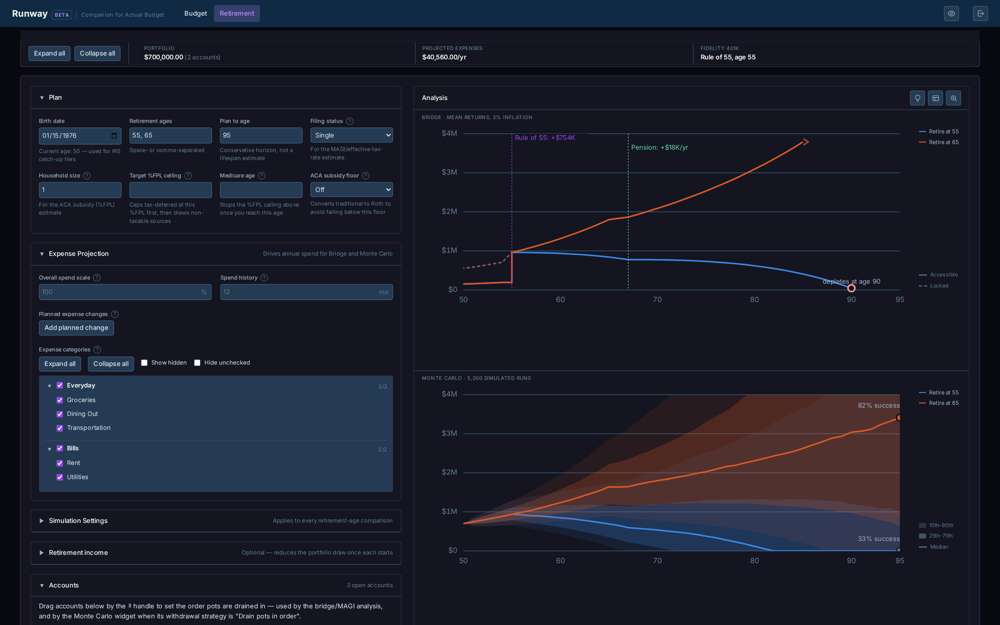
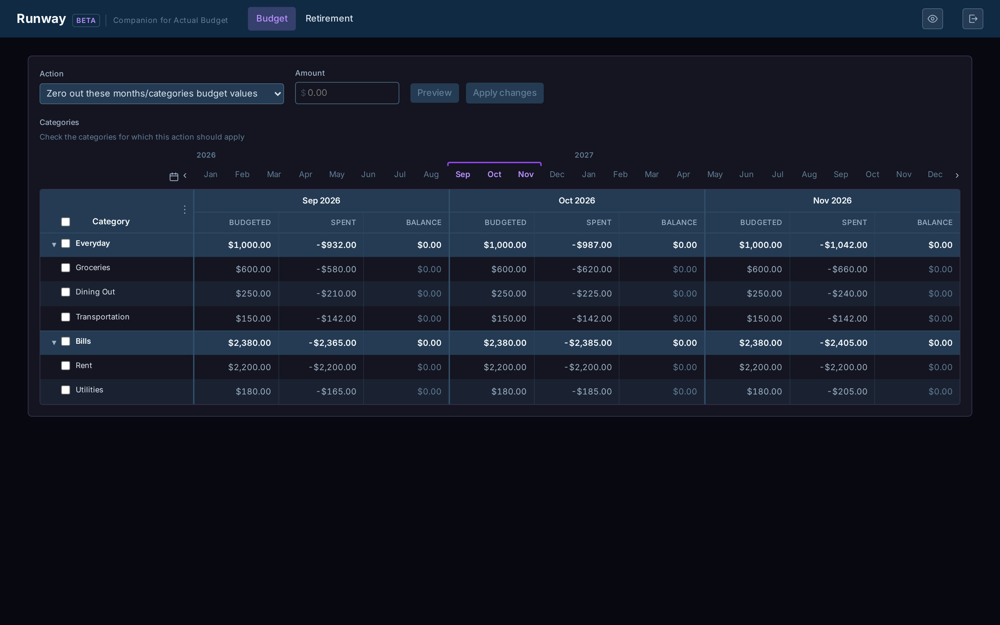

# Actual Budget Tools

A self-hosted companion app **Runway**, and a handful of command-line
tools to supplement an [Actual Budget](https://actualbudget.org) instance.

CLI features:
- Bulk budget edits
- Spending-anomaly detection

Runway features:
- Two modes: "Linked" or "Detached"
- "Linked" mode:
  - Connects to your running instance of Actual Budget and the [Actual Budget REST API](https://github.com/jhonderson/actual-http-api) companion service
  - Provides a UI for bulk budget edits, with a live preview
  - Retirement/FIRE planning and projections against your real accounts
- "Detached" mode:
  - Fully independent, no Actual Budget instance required
  - Stateless; all values entered are retained client-side (browser storage)
  - Allows manual entry of accounts/projected expenses
  - Provides support for importing CSV/TSV files

Retirement/FIRE charts track projected expenses against projected account balances, identifying accessible/inaccessible funds. The Bridge chart marks ages of significant changes: a Rule of 55 boost, debt payoffs, or retirement income kicking in.



Bulk budget edits with a live preview, styled after Actual's own budget
table:



## Getting Started

### Before you start

- For both "linked" and "detached" modes:

  - [Docker](https://docs.docker.com/get-docker/) installed and running.

- For "linked" mode only:
   - A self-hosted Actual Budget server already running, with a budget open
    on it. 
  - A self-hosted [Actual Budget REST API](https://github.com/jhonderson/actual-http-api)
    server deployed and pointed at that Actual server.
  - Your budget's **Sync ID**, found under Settings → Show advanced
    settings in Actual itself, and the **API key** you set for your
    actual-http-api server (its own `API_KEY` environment variable — not
    something Actual generates).

Once you have those, start the container:

```sh
./actual service start
```

1. Open **http://localhost:4276** in your browser.
2. If you have an Actual Budget server, log in with your Actual Budget REST API server's own **URL**, your budget's **Sync ID**, and the **API key** you set for that server. If you don't have an Actual Budget server, choose **Import files** and upload a plain CSV/TSV of your account balances (importing transactions is optional)

Just want to try the calculator with made-up numbers and no data at all?
`./actual service start --mode detached` starts a completely separate,
always-on deployment in its own container and on its own port (`4277` by
default). It has no connection to any external service, and the server
enforces that: nothing is sent anywhere and nothing is stored on the
server. Your plan and account list live only in the browser's own local
storage.

Check on it any time with `./actual service status`, stop it with
`./actual service stop`.

### Building it from source

```sh
git clone https://github.com/tartale/actual-tools.git
cd actual-tools
./actual build image
```

Detailed documentation on the CLI tools, the Runway app, file formats, and
development notes can be found in
[docs/reference.md](docs/reference.md).

**A note on security**: this app has no login of its own protecting it on
the network — anyone who can reach its port can open it and use your
saved Actual login. That's a deliberate tradeoff for a simple, single-user
home setup, not an oversight. Keep it on a trusted home network, and never
expose it to the public internet without adding real authentication first.
